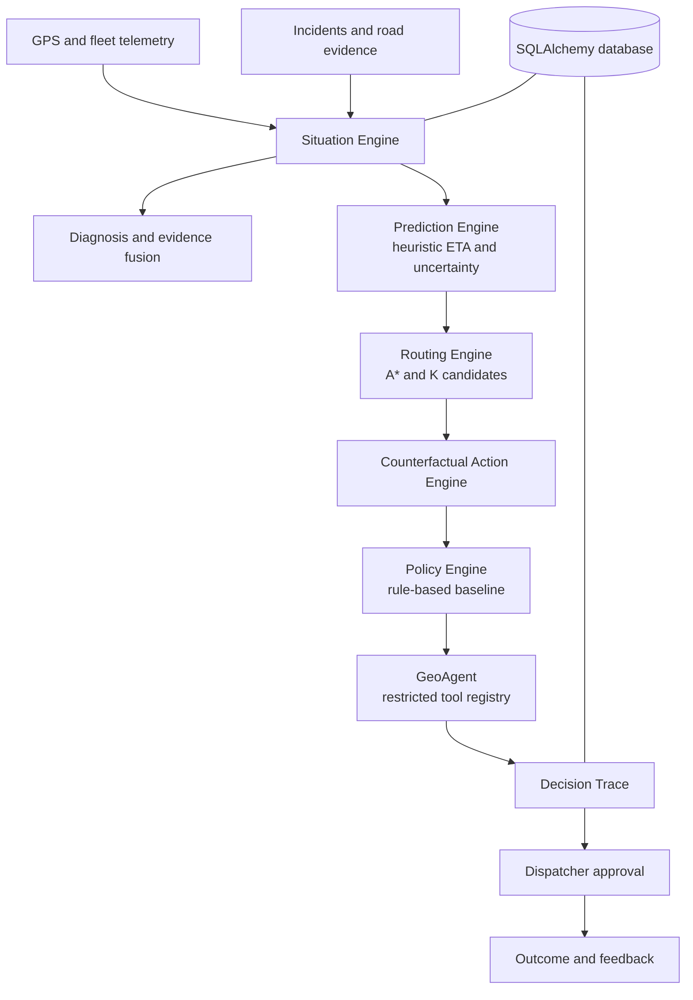

# GeoAgentic

## Emergency Decision Intelligence Platform

GeoAgentic is a real-time emergency decision intelligence platform that maintains a live model of the emergency situation, predicts how it will evolve, simulates competing response actions, evaluates their risk, uncertainty and resource impact, and gives the dispatcher an evidence-backed decision.

This repository is a modular-monolith prototype. It uses a deterministic road graph, persisted demo data and transparent baseline predictors. It is decision support, not an autonomous medical or emergency authority.

**Dispatcher Copilot in one line:** the dispatcher asks (typed or spoken) *"Show the best alternative route for AMB-07"*, GeoAgent analyses live incidents, predicts the delay with an uncertainty interval, compares continue / reroute / backup actions, explains why, and the dispatcher approves or rejects. Every step is traced.

## What's new in v3 (merged build)

This build merges the two GeoAgentic codebases. The decision engine, GeoAgent command bar, benchmark and visual design come from **GeoAgent v2**; the operational modules from the **GeoAgentic control plane** (green corridor, AI dispatch, hospital alerts, mountain air rescue) were rebuilt on top of the same incident-aware road graph, so every module reacts to the same live incidents.

### Pages

| Page | URL | What it does |
|---|---|---|
| Overview | `#/` | Live map, diagnosis, recommendation and approval, platform modules |
| Command | `#/command` | Log calls by clicking the map, resolve incidents, ask GeoAgent, approve/reject, compare routes |
| Response | `#/response` | AI dispatch (routed ETA, golden-hour budget, coverage cost), green corridor, hospital capacity desk, pre-alert inbox with acknowledgement |
| Air rescue | `#/air` | Aircraft + landing-zone choice, live weather limits, fuel/range check, task the flight |
| What-if | `#/whatif` | Run the real engine on a copy of the situation (presets or incidents you drop on the map). Never writes to the decision log |
| Coverage | `#/fleet` | Fleet state, share of the area reachable within the target, coverage lost if each unit is committed |
| Evidence | `#/evidence` | Shift report (measured time-to-decision, alert ack time), CSV export, per-decision trace replay, benchmark, audit log |

### New API (all under `/api/v1`)

```text
POST /incidents                      log a call (accident | closure | traffic | medical)
POST /incidents/{id}/resolve
GET  /hospitals                      capacity + readiness (READY / LIMITED / DIVERT)
POST /hospitals/{id}/capacity        hospital desk update (icu, er, oxygen, accepting)
GET  /hospitals/alerts               pre-alert inbox
POST /hospitals/alerts               send en-route update
POST /hospitals/alerts/{id}/ack
GET  /signals                        junction states (simulated controller)
GET  /corridor | POST /corridor/activate | POST /corridor/{id}/deactivate
GET  /dispatch/plan?incident_id=     unit ranking, hospital ranking, golden-hour budget
POST /dispatch/execute               assigns unit, writes audit + hospital pre-alert
GET  /dispatch/assignments | POST /dispatch/assignments/{id}/complete
GET  /coverage?target_min=           coverage grid + impact of committing each unit
GET  /whatif/presets | POST /whatif  counterfactual scenarios (read-only)
GET  /air-rescue/plan | POST /air-rescue/execute   (409 if a safety check fails)
GET  /decisions                      decision log
GET  /reports/shift?hours=           shift report from the trace and audit log
GET  /reports/decisions.csv
GET  /system/status
```

### Honest boundaries

- Medical calls need an ambulance but do not slow traffic; accidents, closures and traffic jams do.
- The signal controller and the aviation data are simulations. Hospital capacity is seeded demo data until a hospital desk updates it.
- Golden-hour budget assumes 10 min on scene; corridor savings assume 30 s average red-light wait per junction. Both are shown in the UI.
- Provider adapters, the control loop and replay are merged too (see "Live integrations" below).

### Live integrations (merged from the control-plane build)

All optional. Without credentials every module runs on built-in sources and says so in the UI (Evidence > Integrations).

| Source | Enable with | What changes |
|---|---|---|
| Google Routes / Mapbox | `GOOGLE_ROUTES_API_KEY` (or `ROUTING_PROVIDER=mapbox` + `MAPBOX_ACCESS_TOKEN`) | The engine plans on real-road route candidates. Their traffic-aware ETA is kept and accidents/closures from the incident registry are added on top (congestion is not counted twice). The same predictor, counterfactuals and policy decide. If the provider fails, the demo graph is used and the decision evidence says so. Results are cached for 60 s. |
| TomTom | `TRAFFIC_PROVIDER=tomtom` + `TOMTOM_API_KEY` | Flow speed near the unit becomes decision evidence; live accidents, jams and closures around the fleet are imported into the incident registry every `INCIDENT_SYNC_SECONDS` (ids `TT-...`) and retired when TomTom drops them. |
| Traccar | `FLEET_PROVIDER=traccar`, `FLEET_API_URL`, `TRACCAR_DEVICE_MAP="12:AMB-07,15:AMB-12"` | GPS positions update the fleet and telemetry tables (route-deviation detection runs on them) and `/ws/telemetry` streams real positions instead of the demo drive. |

**Control loop** (`TWIN_TICK_HZ`, default every 5 s): re-evaluates the focus unit read-only, shows a *conditions changed* banner when the fresh advice differs from the logged decision for two ticks in a row (or the ETA worsens by 1.5+ min), and keeps about 10 minutes of snapshots for Replay. API: `GET /api/v1/twin/snapshot | history | providers`, `POST /api/v1/twin/command {start|stop|reset|tick}`, `WS /ws/twin`.

**Decision log hygiene:** refreshing a page no longer writes a new decision when the recommendation is unchanged; the pending decision is reused for up to 5 minutes.

Provider calls were tested against mocked vendor responses only (no network access to the vendors from the build machine). Check each one with your own key before a customer demo.

### Tests

`python -m pytest -q` from `backend/` runs 34 tests, including `app/test_operations.py` for intake, dispatch, divert handling, corridor, what-if isolation, coverage, air-rescue safety blocks, reports and the hospital command.

## Problem

Emergency vehicles face congestion, accidents, closures, unexpected delays and fragmented operational information. Dispatchers need a grounded comparison of what to do next, not just a map pin or a shortest route.

## Core Question

> Given everything happening right now, what should we do next - and why?

## What Makes the System Different

The backend is organized around decisions rather than routes:

```text
Observe -> Situation -> Diagnose -> Predict -> Counterfactual Actions
			 -> Evaluate -> Policy -> Recommend -> Explain -> Human Decision -> Feedback
```

The operational integration is the project focus. The individual algorithms are established techniques and are not presented as novel research.

## System Architecture



## Implemented Components

### Situation Engine

`SituationEngine` combines current vehicle state, active incidents and recent telemetry into a `SituationState`. It calculates proximity, speed change, diagnosis confidence and stale-data status. Each conclusion has structured evidence IDs, source, relevance and confidence.

### Incident-aware Risk Model

`services/risk.py` turns incidents into per-road slow-down and risk. An incident affects a road in proportion to how much of that road lies inside its influence zone; accidents, closures and traffic have different strengths, scaled by severity. Incidents only ever *slow* roads, which keeps the straight-line A* heuristic admissible, so routes stay optimal (tested against Dijkstra on every node pair). `services/planner.py` builds the planned route (free-flow shortest path), generates alternatives under live conditions, and scores every route, including "continue", under the same live conditions. The demo graph stands in for a real route via an explicit `CITY_SCALE` constant.

### Trajectory and Routing

The A* graph remains the deterministic routing core. The bounded K-route generator now blocks previously used spur edges, returning distinct alternatives. `TrajectoryEngine` persists GPS points, planned/actual route samples, route progress, deviation distance and abnormal speed flags. Deviation is measured to the route *line segments* (not just its vertices), so a long straight segment does not cause false alarms. The graph supports dynamic risk penalties, and `SpatialGrid` remains available for local spatial lookup. A production map-matching/HMM implementation is planned; the current telemetry comparison is a transparent baseline.

### Prediction and Uncertainty

`HeuristicETAPredictor` is an explicit baseline, not a trained ML model. It returns an ETA estimate, lower and upper interval, confidence, uncertainty, model name, version and feature names. The incident slow-down is applied once, by the risk model, and the interval widens on riskier routes. In the benchmark the raw interval covers only about 70% of outcomes, and a simple split-conformal calibration brings that to about 89% on held-out scenarios (target 90%). Traffic and risk predictors can be added behind the same replaceable service boundary.

### Counterfactual Actions

The action engine evaluates `continue`, `reroute` alternatives, `dispatch_backup` and the hedges `continue_and_dispatch` / `reroute_and_dispatch` using ETA, interval, risk, delay probability, evidence IDs and coverage impact. Backup ETA is a routed travel time under live conditions plus a turn-out allowance, and the nearest backup is chosen by that ETA. This lets the system compare actions, not only routes.

### Fleet and Policy Reasoning

The current fleet calculation identifies available backup units and estimates backup response time from persisted vehicle positions. Dispatching a backup exposes a coverage-change trade-off. `RuleBasedPolicy` is safety-first and uncertainty-aware: it picks the best route by ETA plus risk, leaves the current route only for a real gain, and recommends a backup only when the *upper bound* of the best ETA exceeds the operator's response target (`RESPONSE_TARGET_MIN`, default 15), because a backup reduces regional coverage. An RL or optimization policy can implement the same interface later; no RL model or performance claim is included.

### GeoAgent

The GeoAgent is a grounded orchestrator and deterministic fallback. It may call only registered tools such as `get_vehicle_state`, `get_incidents` and `get_situation`; unknown tools are rejected. It does not calculate routes, invent traffic, estimate hospital capacity or execute arbitrary code. An LLM provider is not required for the decision path.

### Natural-language Commands

`POST /api/v1/agent/command` handles dispatcher commands such as "Show the best alternative route for AMB-07", "Why is it delayed?" or "Is a backup needed?". Intent detection is deterministic. The answer is built from the engine's structured decision. If `ANTHROPIC_API_KEY` is set, an LLM may only rephrase that answer, and the rephrasing is discarded if it contains any number that is not in the facts. Chat can never approve or dispatch; approval is a separate, traced action. Voice input uses the browser's Web Speech API where available.

### Decision Trace and Human Approval

Decisions persist situation, evaluated actions, recommendation, policy version, evidence references and timestamps. Approval, rejection and outcome records are separate trace events. The dispatcher remains the final decision maker.

### Simulation

The simulation API provides reproducible synthetic state for accident/congestion, road closure, traffic spike and competing emergencies. The accident scenario also invokes the decision engine and persists its run. Full time-stepped road/fleet simulation and benchmarking are planned.

## ML / DL and RL Status

- **Implemented:** transparent heuristic ETA baseline, deterministic evidence fusion, incident-aware graph routing, uncertainty intervals with split-conformal calibration (in the benchmark), rule-based policy, grounded natural-language commands.
- **Interfaces ready:** replaceable ETA/prediction and policy boundaries, model/policy version fields, structured features and evidence.
- **Planned:** trained ETA, traffic forecasting, incident classification, computer-vision road evidence, RL policy learning and calibration experiments.
- **Not claimed:** trained neural models, validated accident detection, RL performance, real-world response-time improvements, dispatcher decision-time reduction or deployment results. Benchmark numbers below come from a synthetic simulator.

## API

Legacy frontend-compatible routes remain available:

- `GET /api/health`, `GET /api/ready`
- `GET /api/vehicles`, `GET /api/incidents`
- `GET /api/recommendations/{vehicle_id}`
- `POST /api/vehicles/{vehicle_id}/actions`
- `GET /api/audit`
- `WS /ws/telemetry`

Decision-intelligence routes are versioned under `/api/v1`:

- `GET /api/v1/situations/{vehicle_id}`
- `POST /api/v1/vehicles/{vehicle_id}/telemetry`
- `POST /api/v1/routes/generate`
- `POST /api/v1/actions/generate`, `POST /api/v1/actions/evaluate`
- `POST /api/v1/decisions/analyze` with `{"vehicle_id":"AMB-07"}`
- `GET /api/v1/decisions/{decision_id}`
- `GET /api/v1/decisions/{decision_id}/trace`
- `POST /api/v1/decisions/{decision_id}/approve`
- `POST /api/v1/decisions/{decision_id}/reject`
- `POST /api/v1/decisions/{decision_id}/outcome`
- `GET /api/v1/decisions/{decision_id}/feedback`
- `GET /api/v1/agent/tools?vehicle_id=AMB-07`
- `GET /api/v1/simulation/scenarios`
- `POST /api/v1/simulation/run`
- `GET /api/v1/evaluation/strategies`
- `POST /api/v1/agent/command` with `{"text":"Show the best alternative route for AMB-07"}`
- `GET /api/v1/evaluation/run?n=300&seed=7` (seeded synthetic benchmark)

Decision responses include the recommended action, ETA interval, risk, fleet impact, alternatives, evidence, reasoning, model/policy versions and an approval requirement.

## Project Structure

```text
backend/app/
	algorithms/              A*, K routes, spatial indexing and geometry helpers
	api/                     legacy and versioned FastAPI routes
	core/                    environment configuration
	db/                      SQLAlchemy engine and sessions
	models/                  fleet, incident, telemetry and decision entities
	schemas/                 request and response validation
	services/
		situation.py           live situation and evidence fusion
		risk.py                incident slow-down and route risk (pure Python)
		planner.py             planned route, live alternatives, backup ETA (pure Python)
		nlcommand.py           grounded natural-language commands (pure Python)
		benchmark.py           seeded synthetic benchmark (pure Python)
		prediction.py          replaceable ETA baseline
		counterfactual.py      action generation and evaluation
		policy.py              rule-based policy interface
		agent.py               restricted GeoAgent tools
		engine.py              decision composition and trace persistence
		simulation.py          synthetic scenario runner
frontend/                  React, TypeScript, Vite and Leaflet dashboard
```

## Setup

Prerequisites: Python 3.13+, Node.js 20+, npm, and optionally Docker Desktop for PostgreSQL.

```powershell
Copy-Item .env.example .env
python -m pip install -r backend/requirements.txt
python -m pip install -r backend/requirements-dev.txt
Push-Location frontend
npm install
Pop-Location
```

For local development without Docker/PostgreSQL, use SQLite:

```powershell
$env:DATABASE_URL = 'sqlite:///./geoagentic.db'
$env:ALLOWED_HOSTS = 'localhost,127.0.0.1'
$env:CORS_ORIGINS = 'http://localhost:5173'
Push-Location backend
python -m uvicorn app.main:app --host 0.0.0.0 --port 8000
Pop-Location
```

In a second terminal:

```powershell
Push-Location frontend
npm run dev
Pop-Location
```

With Docker available, `docker compose up --build` starts PostgreSQL, the API and the frontend. Environment variables include `DATABASE_URL`, `CORS_ORIGINS`, `ALLOWED_HOSTS`, `API_KEY`, `ENVIRONMENT`, `DOCS_ENABLED` and the PostgreSQL settings in `.env.example`. Never commit `.env` or credentials.

## Demo Scenario

The seeded scenario includes AMB-07, available backup units, active incidents and a demo road graph. A decision request can detect the incident context, diagnose disruption, generate distinct routes, evaluate continue/reroute/backup actions, account for coverage impact, choose a deterministic recommendation, persist a trace, accept dispatcher approval and record an outcome.

## Testing

```powershell
Push-Location backend
python -m pytest -q
Pop-Location
Push-Location frontend
npm run build
Pop-Location
```

Tests cover A* optimality against Dijkstra, incident slow-down monotonicity, reroute / hedge / no-backup policy cases, segment-vs-vertex deviation, benchmark reproducibility, command parsing, the rule that chat cannot approve, and rejection of LLM text that invents numbers. `test_api_smoke.py` runs the HTTP flow: recommendation, command, approval and trace.

## Evaluation

Run it from the dashboard (Evidence section) or `GET /api/v1/evaluation/run?n=300&seed=7`. It runs the real planner, predictor and policy on 300 seeded scenarios. **The world is synthetic**: ground truth is our own simulator with randomised incident strength and reach, 10% unreported incidents, about 40 m position error and per-road noise, so the model is not graded on its own assumptions. Results show the logic is sound, not field performance.

Results for seed 7, 300 scenarios:

| Metric | Result | Target |
|---|---|---|
| ETA error (RMSE) | 1.73 min (free-flow-only estimate: 3.37 min) | <= 4.0 min, met |
| Deviation detection (precision / recall) | 0.997 / 0.993 | >= 0.85, met |
| Decision compute time (p95, no DB or network) | 0.73 ms | <= 30 s, met |
| Route improvement when the planned path is disrupted | 12.5% overall (5.7% for 1.2-1.5x slow-downs, 17.3% for 1.5x+) | >= 20%, **not met** |
| Dispatcher decision-time reduction | not measured | >= 30%, needs a user study |

Strategy comparison (mean hospital arrival, late = over the 15 min target): static shortest path 13.6 min, 34% late; incident-aware routing 12.1 min, 12% late; GeoAgentic policy 12.2 min, 13% late, with the lowest route risk (0.29 vs 0.39 static) and a backup hedge in 13% of cases. Harmful reroutes: 1.7%. The policy is about 0.1 min slower on average than pure incident-aware routing; in exchange it avoids risky roads and hedges against being late.

Other honest notes: the raw ETA interval covers about 70% of outcomes (calibrated: about 89% on held-out scenarios); on this small graph, segment-based deviation detection improves precision only slightly over the old nearest-vertex rule (0.997 vs 0.983) and mainly removes a failure mode on long segments.

Relevant foundations include HMM-style map matching, graph-based traffic forecasting, trajectory ETA prediction, uncertainty-aware routing, spatial retrieval, grounded agents and emergency-response simulation. These are prior or planned foundations, not claims of novelty by this project.

## Roadmap and Limitations

**Implemented:** modular decision path, incident-aware routing, deterministic baselines, evidence and uncertainty objects, distinct route candidates, fleet trade-offs with backup hedging, restricted agent tools, natural-language and voice commands, persistence, human approval via the decision trace, a reproducible synthetic benchmark and frontend compatibility.

**In progress:** richer road-network data, time-stepped simulation, external traffic adapters, migrations and broader integration tests.

**Future research:** trained ML/DL predictors, validated visual road evidence, RL/optimization policies, PostGIS spatial persistence, calibration studies and real-world deployment validation.

The demo traffic and incidents are synthetic. External feeds, hospital capacity, model availability and production authentication are not provided by this repository. The system must remain human-in-the-loop.

## Local end-to-end mission demo

The local build now has a connected mission lifecycle rather than independent demo screens:

`Log incident → AI dispatch → mission created → ambulance moves → green corridor active → hospital pre-alert → automatic 5-minute simulated en-route update → hospital arrival → corridor released → incident resolved.`

The local control loop advances about **1 simulated mission minute per tick**. With `TWIN_TICK_HZ=0.2` (one tick every 5 seconds), the automatic 5-minute hospital update appears after roughly 25 real seconds. This accelerated clock is explicitly a local simulation; real deployments can replace the movement source with Traccar GPS without changing the mission API/UI contract.

### Fastest local setup (no external API key and no database server)

Use SQLite for the company demo. From the repository root:

```bash
python -m venv .venv
# Windows PowerShell:
.venv\\Scripts\\Activate.ps1
pip install -r backend/requirements.txt
$env:DATABASE_URL="sqlite:///./geoagentic.db"
$env:TWIN_TICK_HZ="0.2"
cd backend
python -m uvicorn app.main:app --reload --port 8000
```

In another terminal:

```bash
cd frontend
npm ci
npm run dev
```

Open `http://localhost:5173`.

### Optional external integrations

- **Google Routes:** set `GOOGLE_ROUTES_API_KEY` and keep `ROUTING_PROVIDER=google`.
- **TomTom traffic/incidents:** set `TRAFFIC_PROVIDER=tomtom` and `TOMTOM_API_KEY`.
- **Traccar:** set `FLEET_PROVIDER=traccar`, `FLEET_API_URL`, `FLEET_API_USERNAME`, `FLEET_API_PASSWORD`, and `TRACCAR_DEVICE_MAP`.
- **PostgreSQL:** set `DATABASE_URL` to a PostgreSQL URL or use `docker compose up -d db`.

The application remains functional without these credentials through explicitly labelled local routing, hospital, signal and mission simulation sources.
