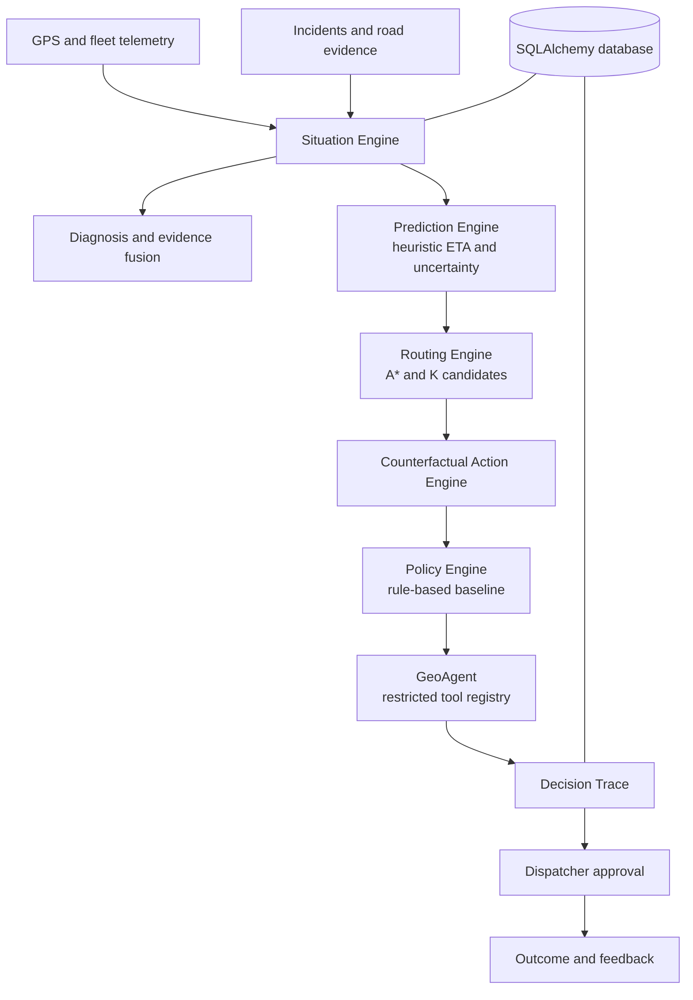

# GeoAgentic

## Emergency Decision Intelligence Platform

GeoAgentic is a real-time emergency decision intelligence platform that maintains a live model of the emergency situation, predicts how it will evolve, simulates competing response actions, evaluates their risk, uncertainty and resource impact, and gives the dispatcher an evidence-backed decision.

This repository is a modular-monolith prototype. It uses a deterministic road graph, persisted demo data and transparent baseline predictors. It is decision support, not an autonomous medical or emergency authority.

## Problem

Emergency vehicles face congestion, accidents, closures, unexpected delays and fragmented operational information. Dispatchers need a grounded comparison of what to do next, not just a map pin or a shortest route.

## Core Question

> Given everything happening right now, what should we do next - and why?

## What Makes the System Different

The backend is organized around decisions rather than routes:

```text
Observe -> Situation -> Diagnose -> Predict -> Counterfactual Actions
			 -> Evaluate -> Policy -> Recommend -> Explain -> Human Decision -> Feedback
```

The operational integration is the project focus. The individual algorithms are established techniques and are not presented as novel research.

## System Architecture



## Implemented Components

### Situation Engine

`SituationEngine` combines current vehicle state, active incidents and recent telemetry into a `SituationState`. It calculates proximity, speed change, diagnosis confidence and stale-data status. Each conclusion has structured evidence IDs, source, relevance and confidence.

### Trajectory and Routing

The existing A* graph remains the deterministic routing core. The bounded K-route generator now blocks previously used spur edges, returning distinct alternatives. `TrajectoryEngine` persists GPS points, planned/actual route samples, route progress, deviation distance and abnormal speed flags. The graph supports dynamic risk penalties, and `SpatialGrid` remains available for local spatial lookup. A production map-matching/HMM implementation is planned; the current telemetry comparison is a transparent baseline.

### Prediction and Uncertainty

`HeuristicETAPredictor` is an explicit baseline, not a trained ML model. It returns an ETA estimate, lower and upper interval, confidence, uncertainty, model name, version and feature names. Traffic and risk predictors can be added behind the same replaceable service boundary.

### Counterfactual Actions

The action engine evaluates `continue`, `reroute` alternatives and `dispatch_backup` using ETA, interval, risk, delay probability, evidence IDs and coverage impact. This lets the system compare actions, not only routes.

### Fleet and Policy Reasoning

The current fleet calculation identifies available backup units and estimates backup response time from persisted vehicle positions. Dispatching a backup exposes a coverage-change trade-off. `RuleBasedPolicy` selects using ETA, risk and coverage impact. An RL or optimization policy can implement the same interface later; no RL model or performance claim is included.

### GeoAgent

The GeoAgent is a grounded orchestrator and deterministic fallback. It may call only registered tools such as `get_vehicle_state`, `get_incidents` and `get_situation`; unknown tools are rejected. It does not calculate routes, invent traffic, estimate hospital capacity or execute arbitrary code. An LLM provider is not required for the decision path.

### Decision Trace and Human Approval

Decisions persist situation, evaluated actions, recommendation, policy version, evidence references and timestamps. Approval, rejection and outcome records are separate trace events. The dispatcher remains the final decision maker.

### Simulation

The simulation API provides reproducible synthetic state for accident/congestion, road closure, traffic spike and competing emergencies. The accident scenario also invokes the decision engine and persists its run. Full time-stepped road/fleet simulation and benchmarking are planned.

## ML / DL and RL Status

- **Implemented:** transparent heuristic ETA baseline, deterministic evidence fusion, graph routing, uncertainty intervals and rule-based policy.
- **Interfaces ready:** replaceable ETA/prediction and policy boundaries, model/policy version fields, structured features and evidence.
- **Planned:** trained ETA, traffic forecasting, incident classification, computer-vision road evidence, RL policy learning and calibration experiments.
- **Not claimed:** trained neural models, validated accident detection, RL performance, response-time improvements or real-world deployment results.

## API

Legacy frontend-compatible routes remain available:

- `GET /api/health`, `GET /api/ready`
- `GET /api/vehicles`, `GET /api/incidents`
- `GET /api/recommendations/{vehicle_id}`
- `POST /api/vehicles/{vehicle_id}/actions`
- `GET /api/audit`
- `WS /ws/telemetry`

Decision-intelligence routes are versioned under `/api/v1`:

- `GET /api/v1/situations/{vehicle_id}`
- `POST /api/v1/vehicles/{vehicle_id}/telemetry`
- `POST /api/v1/routes/generate`
- `POST /api/v1/actions/generate`, `POST /api/v1/actions/evaluate`
- `POST /api/v1/decisions/analyze` with `{"vehicle_id":"AMB-07"}`
- `GET /api/v1/decisions/{decision_id}`
- `GET /api/v1/decisions/{decision_id}/trace`
- `POST /api/v1/decisions/{decision_id}/approve`
- `POST /api/v1/decisions/{decision_id}/reject`
- `POST /api/v1/decisions/{decision_id}/outcome`
- `GET /api/v1/decisions/{decision_id}/feedback`
- `GET /api/v1/agent/tools?vehicle_id=AMB-07`
- `GET /api/v1/simulation/scenarios`
- `POST /api/v1/simulation/run`
- `GET /api/v1/evaluation/strategies`

Decision responses include the recommended action, ETA interval, risk, fleet impact, alternatives, evidence, reasoning, model/policy versions and an approval requirement.

## Project Structure

```text
backend/app/
	algorithms/              A*, K routes and spatial indexing
	api/                     legacy and versioned FastAPI routes
	core/                    environment configuration
	db/                      SQLAlchemy engine and sessions
	models/                  fleet, incident, telemetry and decision entities
	schemas/                 request and response validation
	services/
		situation.py           live situation and evidence fusion
		prediction.py          replaceable ETA baseline
		counterfactual.py      action generation and evaluation
		policy.py              rule-based policy interface
		agent.py               restricted GeoAgent tools
		engine.py              decision composition and trace persistence
		simulation.py          synthetic scenario runner
frontend/                  React, TypeScript, Vite and Leaflet dashboard
```

## Setup

Prerequisites: Python 3.13+, Node.js 20+, npm, and optionally Docker Desktop for PostgreSQL.

```powershell
Copy-Item .env.example .env
python -m pip install -r backend/requirements.txt
python -m pip install -r backend/requirements-dev.txt
Push-Location frontend
npm install
Pop-Location
```

For local development without Docker/PostgreSQL, use SQLite:

```powershell
$env:DATABASE_URL = 'sqlite:///./geoagentic.db'
$env:ALLOWED_HOSTS = 'localhost,127.0.0.1'
$env:CORS_ORIGINS = 'http://localhost:5173'
Push-Location backend
python -m uvicorn app.main:app --host 0.0.0.0 --port 8000
Pop-Location
```

In a second terminal:

```powershell
Push-Location frontend
npm run dev
Pop-Location
```

With Docker available, `docker compose up --build` starts PostgreSQL, the API and the frontend. Environment variables include `DATABASE_URL`, `CORS_ORIGINS`, `ALLOWED_HOSTS`, `API_KEY`, `ENVIRONMENT`, `DOCS_ENABLED` and the PostgreSQL settings in `.env.example`. Never commit `.env` or credentials.

## Demo Scenario

The seeded scenario includes AMB-07, available backup units, active incidents and a demo road graph. A decision request can detect the incident context, diagnose disruption, generate distinct routes, evaluate continue/reroute/backup actions, account for coverage impact, choose a deterministic recommendation, persist a trace, accept dispatcher approval and record an outcome.

## Testing

```powershell
Push-Location backend
python -m pytest app/algorithms/test_astar.py app/services/test_decision_components.py
Pop-Location
Push-Location frontend
npm run build
Pop-Location
```

Tests cover graph alternatives, prediction intervals, evidence-grounded diagnosis, action generation and policy selection. Integration smoke tests should exercise the HTTP flow from telemetry/situation through decision, trace, approval and outcome.

## Evaluation and Research Direction

The data model and service boundaries support measuring response time, ETA error, delay reduction, unnecessary reroutes, backup dispatch frequency, fleet coverage, resource utilization, decision latency, action success and calibration. No benchmark numbers are claimed.

Relevant foundations include HMM-style map matching, graph-based traffic forecasting, trajectory ETA prediction, uncertainty-aware routing, spatial retrieval, grounded agents and emergency-response simulation. These are prior or planned foundations, not claims of novelty by this project.

## Roadmap and Limitations

**Implemented:** modular decision path, deterministic baselines, evidence and uncertainty objects, distinct route candidates, fleet trade-offs, restricted agent tools, persistence, human approval and frontend compatibility.

**In progress:** richer road-network data, time-stepped simulation, external traffic adapters, migrations and broader integration tests.

**Future research:** trained ML/DL predictors, validated visual road evidence, RL/optimization policies, PostGIS spatial persistence, calibration studies and real-world deployment validation.

The demo traffic and incidents are synthetic. External feeds, hospital capacity, model availability and production authentication are not provided by this repository. The system must remain human-in-the-loop.
